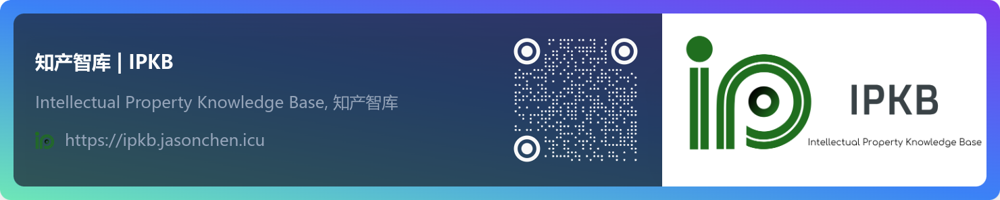

<h2 align="center">
    <b>Hi , I'm Jason Chen. </b>
    
</h2>

### Jason

💼 was previously employed as an **International Patent Engineer** in a patent agency.

📚 is an Intellectual Property practitioner, and hoping to become an **attorney**.

💻 is an amateur yet passionate developer with love for Linux.

🌎 is proficient in English, and capable of providing support in [ 两文三语 | 兩文三語 | biliteracy and trilingualism | 🇨🇳🇭🇰🇺🇸 ]

🔢 owns a bachelor's degree in Mathematics - Information and Computing Science.

☕️ is a coffee lover, and refuses to [brew coffee with a Teapot](http://error418.net/) according to [HTCPCP/1.0 (RFC 2324)](https://datatracker.ietf.org/doc/html/rfc2324/).

### Have a Tech Stack of

#### Category I

> Stuff I care.

#### Category II

> Stuff I don't care.

#### Category III

> Stuff No one cares.

### Currently working on 

